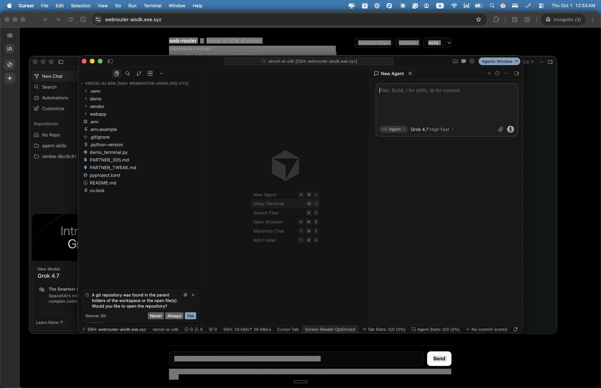
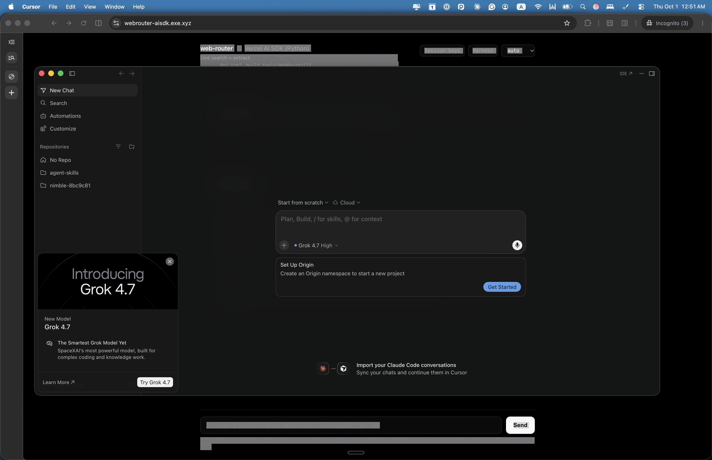
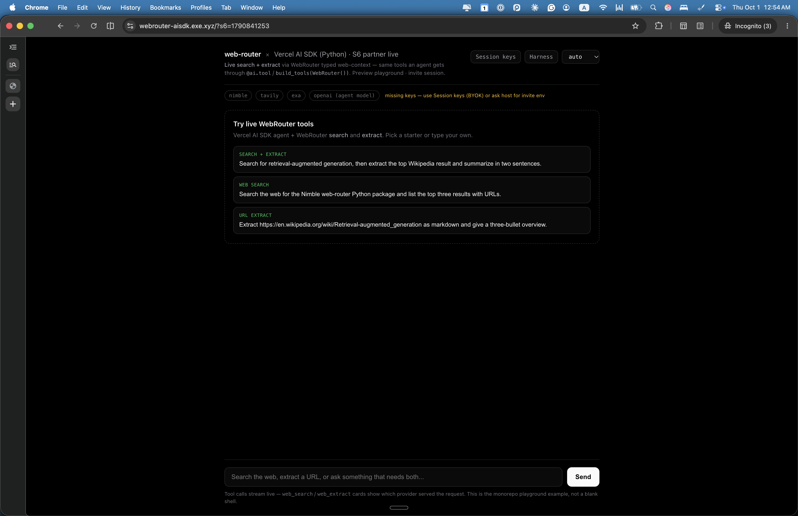

# Partner Sandbox Flows

This document describes the access ladder for the WebRouter sandbox, from initial Web access through live code editing.

> **Hosted sandbox:** https://webrouter-aisdk.exe.xyz/  
> **Public repository:** https://github.com/wildcard/web-router-playground  
> **Package:** Nimbleway/web-router

---

## The Access Ladder

### 1. Start with Web Access

New partners begin with **Web-only access** to the shared sandbox.

- Access the HTTPS playground at `https://webrouter-aisdk.exe.xyz/` after logging into exe.dev
- Full chat UI with live web search and extract tools
- System prompt and configuration controls
- **No shell, SSH, or IDE access at this stage**

This Web-only access includes host-provided demo keys in some cases, which are injected server-side and never visible to partners. You can also paste your own keys via the Session keys panel in the UI.

**This is the recommended path for evaluating WebRouter's capabilities.** Most partners do not need code editing access.

### 2. Learn from the Public Repository

The complete source code is available in the public repository:

- Repository: https://github.com/wildcard/web-router-playground
- Package documentation: Nimbleway/web-router (where relevant)

Browse the code, study the integration patterns, and understand the architecture before requesting live editing access.

### 3. Request Live Code Editing (Optional)

If you need to modify code in the hosted environment, **reply to your sandbox invite contact** to request provisioning. Do not expect automatic IDE access.

The operator will provision one of two paths:

#### Option A: Upgraded Access on Shared VM

For trusted partners working with the primary sandbox:

1. Operator clears any host-injected keys from the environment
2. Your access is upgraded to **Root/Editor** (requires existing exe.dev account)
3. You provide your own API keys via Session keys or local environment
4. You connect via VS Code or Cursor Remote-SSH to edit code
5. After changes, the operator remounts the app so you can verify

**Security constraint:** Root access is never granted while host-provided keys are in the process environment, because Root access can read all environment variables and files.

#### Option B: Dedicated Partner VM (Preferred at Scale)

For isolated editing or when multiple partners need concurrent access:

1. Operator clones a dedicated VM for you
2. You receive access (Web or Root) to your own VM instance
3. You use your own API keys (BYOK) or partner-scoped credentials
4. You have an isolated environment without affecting the shared sandbox
5. The VM is torn down when your evaluation is complete

This approach provides better isolation and avoids contention on shared resources.

### 4. Operator Provisions Access

**You do not self-upgrade access levels.** The operator team controls:

- When host-injected keys are cleared from environments
- When Root/Editor access is granted
- Whether a dedicated VM is provisioned
- Key management and security posture

After provisioning, you'll receive connection details and can proceed with your live code modifications.

---

## Access Level Summary

| Phase | Access Type | Keys | Operator Action Required |
|-------|-------------|------|-------------------------|
| **Initial evaluation** | Web-only | Host demo keys or your BYOK | Share invite |
| **Code learning** | Public repository | None (public code) | None |
| **Live editing (shared)** | Root/Editor on shared VM | Your BYOK only | Clear inject, grant Root |
| **Live editing (dedicated)** | Web or Root on your VM | Your BYOK or scoped keys | Clone VM, grant access |

---

## Security and Access Rules

### Web Access
- HTTPS playground only
- Cannot access shell, SSH, Terminal, or filesystem
- Cannot read environment variables or process information
- Safe with host-provided demo keys

### Root/Editor Access
- Full VM access including SSH and IDE connections
- Can read all files and environment variables
- Requires existing exe.dev account
- **Never granted while host keys are present** (custody lock)
- Partner must use own keys (BYOK)

### Private Sharing Model
- Invite-gated access only (no public anonymous access)
- ~15–20 curated evaluation partners
- No public shared API keys
- Login required for all access

---

## Visual Guide: Live Code Editing Flow

The live code editing flow follows these steps:

1. **Web playground** — Initial access with demo or BYOK keys
2. **IDE connection** — After Root access granted, connect via Remote-SSH
3. **Code editing** — Make changes in VS Code or Cursor
4. **Verification** — View changes in hosted playground after remount

### Screenshots

*Cursor Remote-SSH connected to the sandbox, workspace open in `examples/vercel-ai-sdk`*

*Active code editing in the IDE*

*Playground showing live changes after remount*

---

## Cost Considerations (Operator Reference)

For transparency on dedicated VM provisioning:

- **Shared VM access:** No additional cost per partner
- **Dedicated VM (shared capacity):** Uses account's vCPU pool, no per-VM charge
- **Dedicated VM (standalone):** Approximately $0.105 per 2 vCPU per hour while active
- **Example:** 8-hour dedicated VM session ≈ $0.84

Dedicated VMs are provisioned as needed and torn down after evaluation to manage costs.

---

## Getting Started

1. **Register** on exe.dev with the email your contact provides
2. **Access** the Web playground at https://webrouter-aisdk.exe.xyz/
3. **Explore** the hosted demo with provided keys or paste your own
4. **Learn** from the public repository at https://github.com/wildcard/web-router-playground
5. **Request** live editing access if needed by replying to your invite contact

See [PARTNER-ACCESS.md](PARTNER-ACCESS.md) for detailed access setup, [PARTNER-EMAIL-ADDON.md](PARTNER-EMAIL-ADDON.md) for the quick start message, and the [vercel-ai-sdk integration guide](../examples/vercel-ai-sdk/README.md) for technical details.
